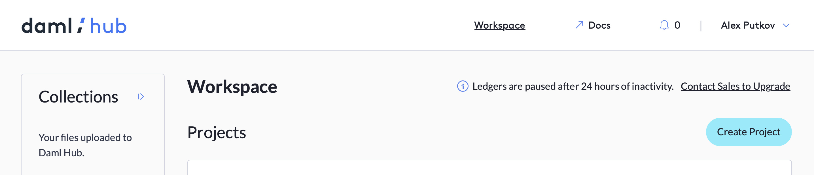
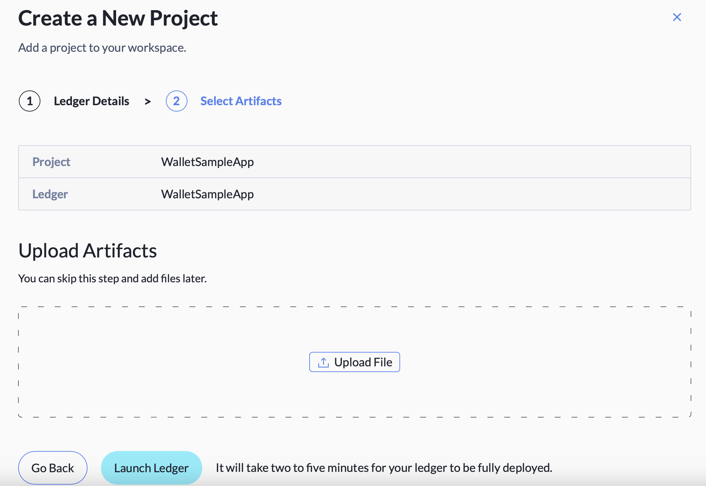
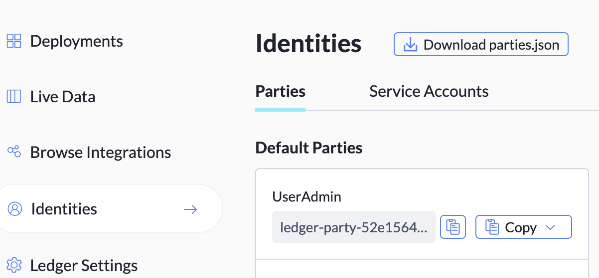
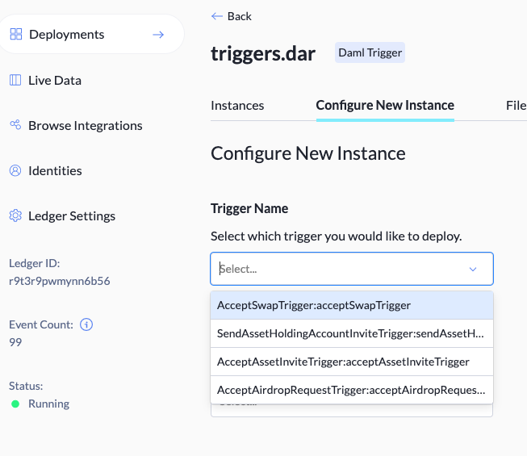
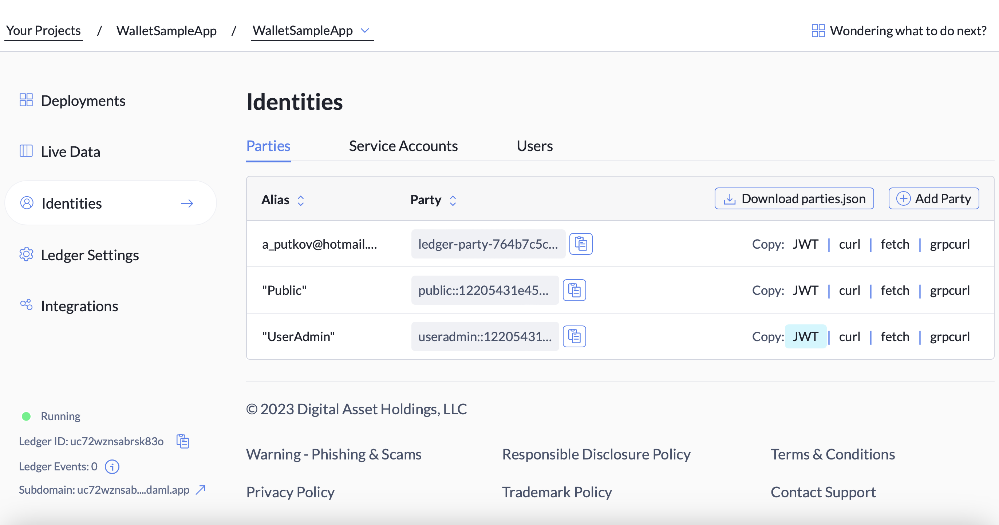

[](https://www.daml.com)

[](https://docs.daml.com/getting-started/installation.html)
[](https://github.com/digital-asset/wallet-sample-app/blob/main/LICENSE)  
Copyright (c) 2022 Digital Asset (Switzerland) GmbH and/or its affiliates. All Rights Reserved. SPDX-License-Identifier: Apache-2.0

# Welcome to the Wallet Daml Sample App

The Wallet Sample App is an open-source digital asset wallet powered by [Daml](https://www.digitalasset.com/developers) smart contracts and [Daml/React](https://docs.daml.com/app-dev/bindings-ts/) Javascript library, and deployed in [Daml Hub](https://www.digitalasset.com/products/daml-hub). This app provides developers with a working example of how to implement essential workflows related to digital assets (or tokens) such as asset issuance, airdrop, transfer and atomic swap. We assume the developer already has basic knowledge of Daml.

You can watch the video walkthrough of the application [here](https://myinteractive.video/w/fgbRdGusDeoo)

You can play around with user functionality in the Wallet Daml Sample App without deploying the app, as it is continuously running at [https://wallet.daml.app](https://wallet.daml.app). To sign in to the app running at [https://wallet.daml.app](https://wallet.daml.app), use your Daml Hub account. You can create a free [Daml Hub](https://www.digitalasset.com/products/daml-hub) account, if you don't already have one.

User workflows implemented in Wallet Daml Sample App include the following features 
- Creating an asset holding account
- Issuing assets (creating new quantities of an asset in an issuer party account)
- Airdropping assets (creating new quantities of an asset in a non-issuer party account)
- Inviting other users to create their asset holding accounts
- Sending assets to other users (asset ownership transfer)
- Swapping assets (atomic swap - simultaneous transfer of ownership of two assets between two parties)
The app is centered around the concepts of asset and asset holding account. To learn about these concepts and their implementation in this app see [Wallet Daml Sample App - concepts and their implementation](Concepts.md) article.

The frontend of the project was bootstrapped with [Create React App](https://github.com/facebook/create-react-app).
However, all Daml specific aspects of the UI client are written in plain TypeScript. The React framework can be easily replaced with any other UI framework.

# Prerequisites
- [Daml SDK](https://docs.daml.com/getting-started/installation.html)
- Java 11 or higher
- [Visual Studio Code](https://code.visualstudio.com)
- [Node.js](https://nodejs.org/en/)

# Running the Project Locally
## Build Required Files
<i>*The below build steps are also necessary for deploying the app to Daml Hub. </i>

1. From the root of the project run
```
make build
```

This will generate the [.dar files](https://docs.daml.com/concepts/glossary.html#dar-file-dalf-file), which include `asset.dar`, `account.dar`, `user.dar`, `triggers.dar`,  that need to be deployed to the backend [Daml ledger](https://docs.daml.com/concepts/glossary.html#daml-ledger).  

2. From the root, run 
```
make codegen
```  
This will execute the below script. Alternatively you can copy and paste the below into the command line.
```
daml codegen js  main/Asset/asset.dar main/User/user.dar main/Account/account.dar -o ui/daml.js
```  
The script will generate a `daml.js` folder in the `/ui` directory with the JavaScript bindings.

3. Navigate to the ui directory from the root by running `cd ui` and run `npm install`

## Start Backend Processes
1. In the terminal, from the project root directory, run 

```
./start.sh
```
The script executes several setup operations, which alternatively can be run manually. [Click here](#running-startsh-processes-manually) for details.


<b>Please note:</b>
- Each time you make changes to the `.daml` files, you will need to re-run `make build`, and `make codegen` and reinstall the packages on the frontend through `npm i`, so that the frontend packages and dar files are in sync.
- From the project root you can run `daml ledger list-parties` to check if the parties have been uploaded properly. 

## Start the Frontend
2. After running start.sh shell script, the backend of the app is fully functional.
To launch the app GUI in a separate instance of the terminal cd to the `ui` directory and run `npm start`. This should open a browser window with a login screen. If it doesn't, you can manually navigate your browser to http://localhost:3000.
When running locally, the app has the following pre-defined users: "alice", "bob", "charlie", "ron". These users are created by the startup Daml Script in [Setup.daml module](main/Account/daml/Setup.daml). When prompted to sign-in to the app UI, type in one of the above user names and hit Enter. 

# Running `./start.sh` Processes Manually
The `./start.sh` performs the below operations, which can be run manually. If you are executing the start script as instructed above, then you do <b>not</b> need to run the below steps. This is for your reference. 

1. Start the Sandox and upload the dar files.
2. Start JSON API server.
3. Run setup script to allocate parties and create initial contracts (required only for local deployment).
4. Start the 4 triggers.

### 1. Start the Sandbox & Upload the Dar Files
In the terminal run from the project root directory 
```
make sandbox
``` 
or copy and paste the below script and run it from the terminal.

```
daml sandbox --dar main/Asset/asset.dar --dar main/User/user.dar --dar main/Account/account.dar 
```  
Leave this terminal running.

### 2. Start HTTP JSON API Service
In a separate terminal run from the project root directory
```
make server
```
This will run the script below. Alternatively you can copy and paste the below into the terminal and run the script.
```
daml json-api --config json-api-app.conf
```
Leave this terminal running.
### 3. Run Setup Script
In another terminal run the setup script. This script allocates parties, creates an Example Token asset account and Example Token asset contract.   
```
daml script --dar ./main/Account/account.dar --script-name Setup:setup --ledger-host localhost --ledger-port 6865
```
### 4. Start 4 Triggers 
Make sure to run each trigger in a separate instance of the terminal and leave all these terminals running.
For details on why the triggers are needed [click here](#trigger-uses)

1. From the root directory, start the `sendAssetHoldingAccountInviteTrigger` by running the following command in another terminal. This trigger sends an invitation to create an Asset Holding Account for Example Token to new users.
```
daml trigger --dar triggers/triggers.dar \
        --trigger-name SendAssetHoldingAccountInviteTrigger:sendAssetHoldingAccountInviteTrigger \
        --ledger-host localhost \
        --ledger-port 6865 \
        --ledger-user "admin"
```


2. From the root, in a separate terminal instance, run the below trigger. This trigger allows 'admin' user, which corresonds to the party that is the issuer of the Example Token, to automatically accept airdrop requests for Example Token.
```
daml trigger --dar triggers/triggers.dar \
             --trigger-name AcceptAirdropRequestTrigger:acceptAirdropRequestTrigger \
             --ledger-host localhost \
             --ledger-port 6865 \
             --ledger-user "admin"
```

3. From the root, in a separate terminal instance, run the below trigger. This trigger allows 'admin' user, which corresonds to the party that is the issuer of the Example Token, to automatically accept invites to create an Asset Holding Account for user's asset. This invite is created as part of a swap workflow when a user swaps his or her asset for an amount of Example Tokens with 'admin'.
```
daml trigger --dar triggers/triggers.dar \
             --trigger-name AcceptAssetInviteTrigger:acceptAssetInviteTrigger \
             --ledger-host localhost \
             --ledger-port 6865 \
             --ledger-user "admin"
```

4. This trigger allows 'admin' user, which corresonds to the party that is the issuer of the Example Token, to automatically accept a swap proposal created by a user, where the user proposes to swap his or her asset for an amount of Example Tokens with 'admin'.
```
daml trigger --dar triggers/triggers.dar \
             --trigger-name AcceptSwapTrigger:acceptSwapTrigger \
             --ledger-host localhost \
             --ledger-port 6865 \
             --ledger-user "admin"
```

<b><i>Please Note</i></b>   
All the actions in the start.sh shell script are run as background jobs, as they launch processes that need to keep running while the app is being used.

### Starting Frontend (not implemented in `./start.sh`)
Once the above steps are executed, the backend of the app is fully functional. To start the frontend follow the instructions [here](#start-the-frontend).

# Trigger Uses
[Daml triggers](https://docs.daml.com/triggers/index.html) provide automation for certain interactions with the ledger. This project implements 4 triggers, which we need to start. These triggers implement a bot, which provides a party for a human user to swap assets with. When you login as a user to the app frontend for the first time, you automatically receive an invite to create an asset holding account for Example Token (ET). Once you accept the invite, you can request new quantities of the Example Token to be airdropped into your asset holding account. This request is automatically granted. Finally, after creating an asset holding account for a new asset type and after issuing a quantity of this asset into your own account, you can swap this asset for an amount of Example Token. All this functionality demonstrates the workflows implemented in the app without requiring another human user to interact (e.g. trade assets) with.  


# Deploying the project to Daml Hub
The app is continuously run on Daml Hub by Digital Asset at [https://wallet.daml.app](https://wallet.daml.app). You can play with user functionality in the app run by Digital Asset. To sign in to the app UI at the above URL use your Daml Hub account. You can create a free Daml Hub account, if you don't already have one.
You can also deploy your own version of the app on Daml Hub.
First create a free [Daml Hub](https://www.digitalasset.com/products/daml-hub) account.  

To learn how to deploy Daml apps to Daml Hub see [Daml Hub Quickstart](https://hub.daml.com/docs/quickstart/) 


## Setup Project on Daml Hub
Once logged in, click `New Project` on the right side of the hub interface. 



Follow through the steps displayed in the interface, you will be asked to provide a project name and ledger name. 

### Uploading Dar Files
Click the ledger, then click `upload file`



 to upload the dar files created in ["Build Required Files"](#build-required-files) step. These include:
- asset.dar
- account.dar
- user.dar
- triggers.dar

### Upload UI Zip File
2. In addition we need to create `wallet-refapp-ui.zip` file by running `npm run zip` command from in the `ui` directory. This zip file contains the app UI and also needs to be uploaded to Daml Hub.
### Setup Admin Account from Daml Hub Console
3. Setup Admin Account. From the Daml Hub console, click `Identities` and under `Default Parties` add the `UserAdmin`

This will be needed so you can run the triggers as the `UserAdmin`

### Configure triggers for Daml Hub
From Deployments on the left hand menu, 
1. click on `triggers.dar` > `Configure New Instance`
2. Under `Trigger Name`, select the first trigger

3. Under `Party`, select `UserAdmin`
4. Click `Deploy Instance`, and repeat for all other triggers.

### Setup Admin Account on the Deployed App
Before the triggers can run properly, you will need to 
1. Login to the app using the JWT of the UserAdmin
 
2. On the left hand side menu, click `Create`, you will arrive at the asset account creation page
3. In the `symbol` field, name the asset `ET`, then click `Create` at the bottom to finally create the `ET` asset account. 

Once this account is created, other users will be able to receive the automatic ET account asset invitations sent by the triggers, and users will also be able to request airdrops and swap with the UserAdmin. 

